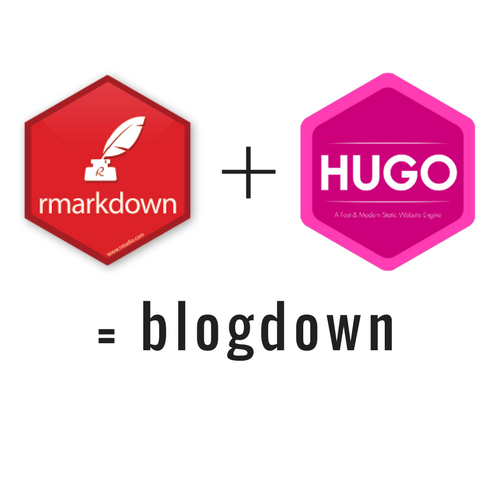
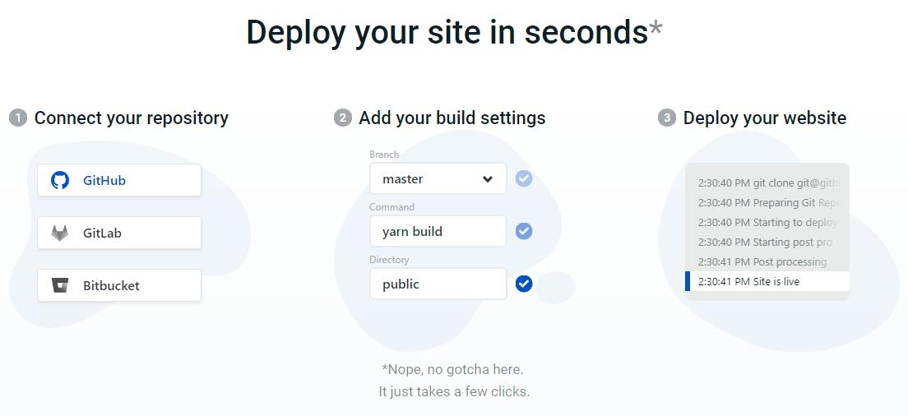
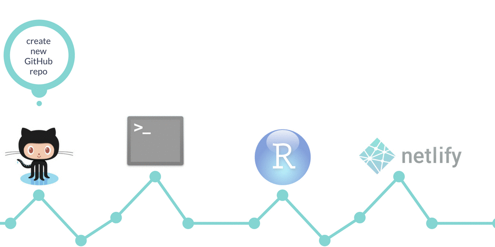

```{r setup, include=FALSE}
options(htmltools.dir.version = FALSE)
```

class:center, middle
## [https://github.com/rstudio/blogdown](https://github.com/rstudio/blogdown)


Image credit: [Yihui.name](https://yihui.name/en/2017/10/the-blogdown-logo/)

---

--- 
# Personal website and blogdown 

### [Why we need a personal website](https://yihui.name/en/2017/06/netlify-instead-of-github-pages/)?
### How can we create a personal website?
### What is [blogdown](https://github.com/rstudio/blogdown)?
### Why blogdown?
### Where can I host my personal website?

---
class: center, middle
# What is blogdown?

In short:
 An R package based on **R Markdown** and **Hugo**

---
##Introduction to blogdown

### blogdown based on R Markdown and Hugo package in R
- R Markdown
  - Very simple grammar
  - Easy to output analysis results into various formats and reproducible
  - Could handle more complicate Math, tables and figures, reference and even proofs.
  
- Hugo
  - Open source, easy to install
  - Very FAST: about 1ms per page.
  - Very wide scope of use (Blog is only one of many uses)
  
---
# Getting started

- [RStudio](https://www.rstudio.com) 1.0 or higher

    RStudio IDE provide powerful GUI help you complete common blog website editing without remember too much syntax.

- [blogdown package](https://blog.rstudio.com/2017/09/11/announcing-blogdown/)
  - install latest version of [blogdown](). 

  ```
  install.packages("blogdown")
  ```

- [Hugo](https://gohugo.io/)
  - Can be install using blogdown package inside R.
```
blogdown::install_hugo()
```
- Git
  - Help you track your own progress
  - Simplify the deployment process

---
# Blogdown demo
- Create a [website using blogdown]() project

## In **RStudio addins** 
- "Serve Site"
- "New Post"
- "Update Metadata"

## A typical workflow when write a new post
- Open the website project in RStudio
- Click "New post" button in [Addins]()
- Write contents and save.
- Take a look at the automatically rendered preview
- Revise and save again
- Commit and push to Git

---
# Website project directory structure

```
.
├── archetypes
├── config.toml
├── content
   └──  post <<- path: `baseurl/post/`
   └──  about.md <<- path: `baseurl/about/`
├── data
├── layouts
├── public
├── static
└── themes
```
inherited from [Hugo directory structure](https://gohugo.io/getting-started/directory-structure/)

---
class:left
# Deploy your website
- HTTP server:[Apache](https://httpd.apache.org/), [Ngnix](https://www.nginx.com/)
- [Github.io](https://pages.github.com/)
- [Netlify](https://www.netlify.com/)

## Netlify


---

# Set a different theme

- [Other Theme options](https://themes.gohugo.io/)
- [hugo-academic theme by John Little](https://github.com/libjohn/blogdown-libjohn)

```
blogdown::new_site(theme = "gcushen/hugo-academic")
```

## Link with Netlify
- Create git repo
- Add and commit your finished website 
- Push to either Github/BitBucket/Gitlab
- Link the repo/branch to the site created on [Netlify](https://www.netlify.com/)

---
class:center, middle

# An ideal workflow for blogdown(big picture)


Image Credit [Alison Presmanes Hill](https://github.com/apreshill/blogdown-workshop/blob/master/slides/images/animated-blogdown.gif)

---
class: center, middle
# Questions?


---
class: center, middle
# Thank you!
